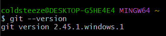
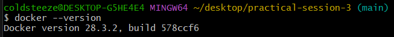
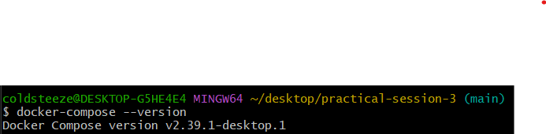
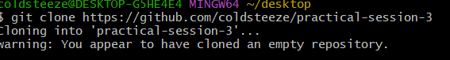

# Практические занятия 2, 3, 4

## 1. Установка Git, Docker и Docker Compose

### Проверка версии Git


### Проверка версии Docker


### Проверка версии Docker Compose


### Клонирование репозитория


---

## 2. Запуск контейнера Nginx

Команда для запуска:
```bash
docker run -d -p 8080:80 -v $(pwd)/index.html:/usr/share/nginx/html/index.html nginx